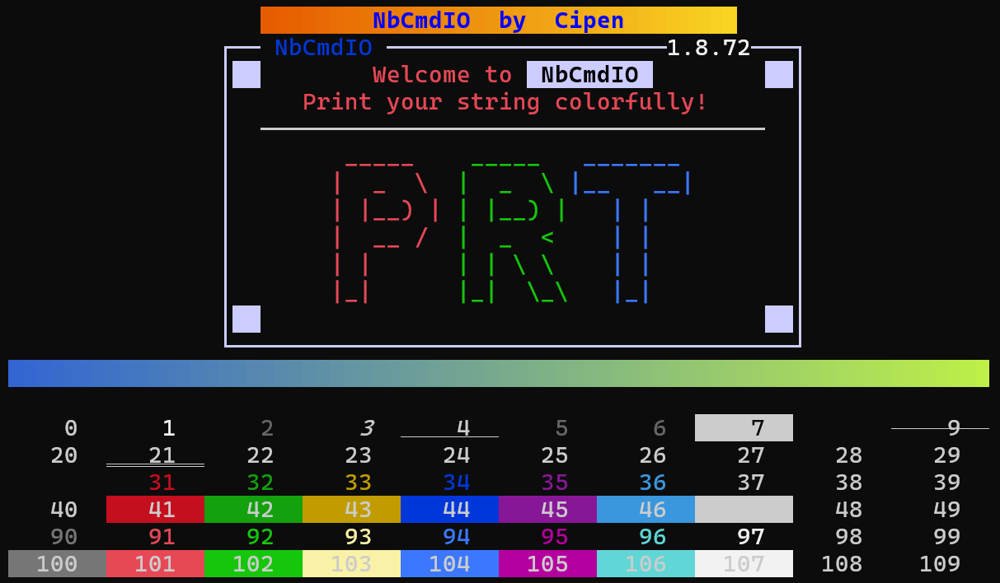

# NbCmdIO: A Powerful Tool for Terminal Colors and Interaction

<div align="center">

[](https://github.com/YXPHOPE/NbCmdIO/blob/main/README.md)
[](https://pypi.org/project/nbcmdio/)
[](https://github.com/YXPHOPE/NbCmdIO/blob/main/LICENSE)

[](https://pypi.org/project/nbcmdio/)
[](https://www.python.org/)



</div>

**NbCmdIO** is a powerful Python library that transforms ordinary command-line terminals into vibrant visual canvases and robust interactive platforms! Say goodbye to monotonous black-and-white outputs and welcome the world of true RGB colors; farewell to clunky text interfaces and embrace precise cursor control and input capture capabilities.

**Keywords**：Terminal, CSI escape sequence, print, colorful, input, cursor, draw, Image, Gif

## 🌟 Core Features

### ⚡ Chainable Calls

- Set cursor positions and styles anytime, anywhere—quick, convenient, and easy to read!

```python
prt[row, col].bold().fg_red("text")
```

### 🎨 True-Color RGB Terminal Styling

- Supports 24 bit RGB and HEX formats for foreground and background colors
- Includes default colors: Black, Red, Green, etc.
- Supports effects like Bold, Underline, Italics, etc.
- True-color image display, with each character representing two pixels for enhanced resolution
  
- Displays ASCII grayscale images

### 🖱️ Character-Level Cursor Control

- Precise character-level cursor positioning
- Save/restore cursor positions
- Get cursor position

### 📦 Dynamic Area Management

- Create independently updatable regions
- Supports nested regions

### ⌨️ Input Capture (In Progress)

- Single-key unbuffered reading
- Shortcut combination detection

## 🚀 Quick Start

### Installation

```bash
pip install nbcmdio
```

### Basic Usage

- Command Line Usage:

```bash
# clear screen and draw a image
prt cls drawImage "path/to/image/file"

# Print in foreground color #CCF, bold and center-aligned
prt fg_hex CCF bold alignCenter "Hello!"

# List all available functions
prt list

# Get help of function
prt help <function>
```

- Python Usage:

```python
from nbcmdio import prt

def NbCmdIO():
    lavender = "#ccf"
    # Clear screen and set terminal title
    prt.cls().setTitle("NbCmdIO")
    # On line 2, bold, blue text, center-aligned with gradient background
    title = "        NbCmdIO  by  Cipen        "
    prt[2].bold().fg_hex("#00f").gotoCenterOffset(getStringWidth(title), 2)
    prt.drawHGrad((230, 92, 0), (249, 212, 35), string=title)
    WIDTH = 40
    HEIGHT = 10
    center_offset = (prt.size_col - WIDTH) // 2
    # Draw a rectangle with foreground #CCF at (3, center_offset) and set the new region to this rectangle
    prt.fg_hex(lavender)[3, center_offset].drawRect(HEIGHT, WIDTH)
    prt.fg_blue()[0, 3](" NbCmdIO ").bold()[0, WIDTH - 8](prt.__version__)
    b2 = "  "
    # Enter context (styles aren't auto-reset inside), add square color blocks at the 4 corners
    with prt.bg_hex(lavender):
        prt[1, 1](b2)[1, WIDTH - 1](b2)
        prt[HEIGHT, 1](b2)[HEIGHT, WIDTH - 1](b2)
    # Add styles within strings (ensure characters are defined separately, not directly in chain calls)
    line1 = f"Welcome to {prt.bold().bg_hex(lavender).fg_hex('#000')} NbCmdIO "
    line2 = "Print your string colorfully!"
    # Save and reuse styles (includes position, color, effects)
    head_style = prt.fg_red().bold().makeStyle()
    prt[1].use(head_style).alignCenter(line1)# Use style in new region's first line for centered text
    prt[2].use(head_style).alignCenter(line2)
    prt[3, 3].fg_grey().drawHLine(WIDTH - 4)
  
    text = r"""
 _____    _____    _______ 
|  _  \  |  _  \  |__   __|
| |__) | | |__) |    | |   
|  __ /  |  _  <     | |   
| |      | | \ \     | |   
|_|      |_|  \_\    |_|   """[1:]
    lines = text.splitlines()
    chr1 = [l[:8] for l in lines]
    chr2 = [l[8:18] for l in lines]
    chr3 = [l[18:] for l in lines]
    prt.fg_red().bold()[4, 8].printLines(chr1)
    prt.fg_green().bold()[4, 16].printLines(chr2)
    prt.fg_blue().bold()[4, 25].printLines(chr3)
  
    # Move cursor to next line in region, then exit
    prt[HEIGHT + 1].setOriginTerm().end()
    prt.gotoCenterOffset(50)
    # Draw a gradient bar, move down 2 lines, test terminal color support
    prt.drawHGrad((51, 101, 211), (190, 240, 72), 50).end(2)
    prt.test().end()

NbCmdIO()
```

## 🔮 Future Roadmap

| Version | Features                           | Status              |
| ------- | ---------------------------------- | ------------------- |
| v1.0    | RGB Color Support, Area Management | ✅ Released         |
| v1.9    | Progress bar                       | ⏳  Developing     |
| v2.0    | Input Capture System               | 📅 Planned          |
| v3.0    | Terminal UI Component Library      | 💡  Conceptualizing |

**PLAN**

* [ ] Progress bar
* [ ] Customized Exception info
* [ ] Async operation

## 🌍 Community Contributions

We welcome all forms of contributions! Whether you:

- Discover and report issues
- Submit feature requests
- Contribute code
- Create documentation
- Share creative use cases

## 📜 Open-Source License

NbCmdIO uses the **MIT License**—feel free to use it in both commercial and personal projects!

## ✨ Experience Terminal Magic Now!

```bash
pip install nbcmdio
```

Ready to elevate your command-line experience to a whole new dimension? NbCmdIO is waiting to bring your terminal to life!

---

## 📜 Changelog

- 1.8.1 Completed all basic Output features, major update
- 1.8.2 Initial unbuffered single-key input capture
- 1.8.3 Fixed issues, added quick PS1 batch files, separated style module
- 1.8.4 Added multi-line region printing, separated utils
- 1.8.5 feat: drawHGrad (gradient), drawIMG (terminal image display)
- 1.8.6 improve: added validation for loc, size;
  feat: drawImageStr
- 1.8.63 feat: Output.playGif
- 1.8.64 fix: height overflow in Output.valSize
- 1.8.7 big change: Many functions have their parameter order as height before width;
  add: Area, Output.clearRegion;
  fix: some little problem
- 1.8.71 feat: FrameTimer, used in Output.playGif
- 1.8.72 add: utils.getIMG support url;
improve: utils.FrameTimer support custom duration for each frame; Output.playGif uses gif duration.
- 1.8.73 fix: Output.gotoCenterOffset; height overflow;
- 1.8.74 fix: return value of Output.drawImageStr;
  add: Output.setFile: file=None, flush;
  fix: Output.print: write by chunk;
  update: system os config
- 1.8.75 improve: 
Performance improved by 2.31x (compared to version 1.8.74, when providing a 474x474 RGB-format Image object and directly outputting it at that size via Output.drawImage)
- 1.8.76 add: support cli tool "prt"

## 🙏 Acknowledgments

- **[colorama](https://github.com/tartley/colorama)** for CSI terminal title methods
- **[timg](https://github.com/adzierzanowski/timg)** for ASCII grayscale image methods and fixing [Issue #4](https://github.com/adzierzanowski/timg/issues/4)
- **[curses](https://github.com/zephyrproject-rtos/windows-curses)** for hline, vline, rectangle methods
